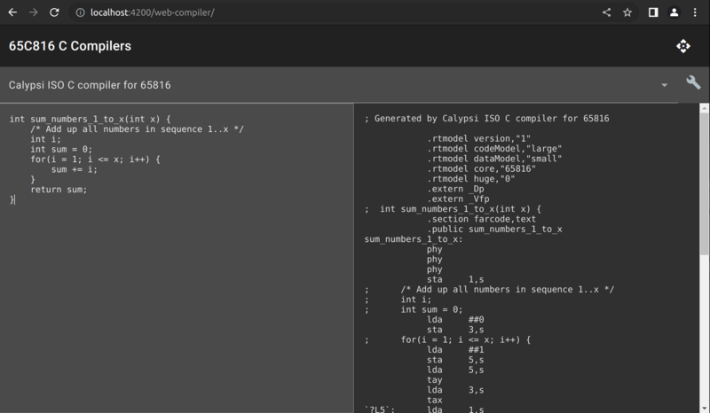

# 65816 C Compilers

This is simple web app to examine the output of compilers which target the classic 65816 CPU architecture. It is inspired by the ever-useful [compiler explorer](https://godbolt.org/).

## License

Copyright 2023 Michael Billington. The 65C816 C compiler web app is free software: you can redistribute it and/or modify it under the terms of the GNU General Public License as published by the Free Software Foundation, either version 3 of the License, or (at your option) any later version. The full text of the license is provided in the LICENSE file in this repository.

The factory icon is from [Templarian/MaterialDesign](https://github.com/Templarian/MaterialDesign), and is licensed under the Apache License 2.0.

A number of free software components are additionally required to build this app. See `frontend/package.json` and `requirements.txt` for a list.

## Note on compiler licenses

The compilers used by this app are distinct software products with their own copyright holders, and are not included in this repository.
